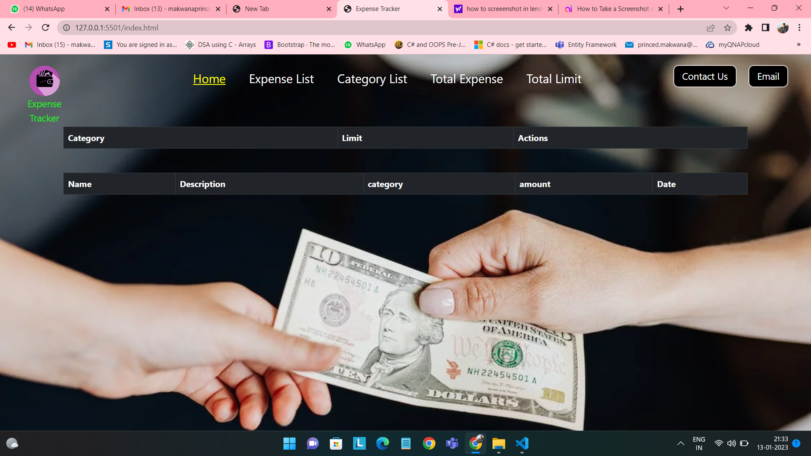

# Welcome to Expense Tracker!

Hi! I'm your guide to expense tracker project. read me to run the project.

# Prerequisites

- Visual Studio (2022)
-  .NET Framework
- .NET Core 
-  NUGet packages
	- ASP.NET Core entity framework
	- ASP.NET Core SQL Server
	- ASP.NET Core Tools
	- ASP.NET Core Design
	- ASP.NET Core Cors
	- Swagger
## Steps for installation
step 1: open visual studio
step 2: install the prerequisites
step 3: load the project
step4: use command update-database in your package manager
step5: run the program
step6: let the swagger run
step7: open the index.html from the directory

## Screenshots

## 
